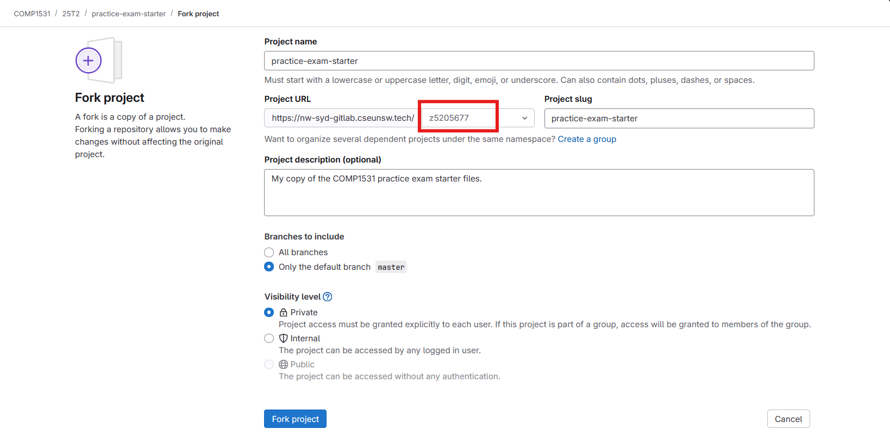

# COMP1531 - Practice Exam

This is a public repository with starter files for the practise exam.

You can find the exam paper for this practice exam here:
- [https://cgi.cse.unsw.edu.au/~cs1531/25T3/practice-exam/](https://cgi.cse.unsw.edu.au/~cs1531/25T3/practice-exam/)

To get started, run `npm install` in the root directory. Then complete questions as usual.

Note: you will not have access to the `submit` command - this is exclusive to the exam environment.

---

If you would like your own private version of this repository to try the practice-exam at home, you can create a *fork* of the public repository before starting.

This is *optional* and only needed if you'd like to backup (i.e. push/pull) your work  to GitLab.

